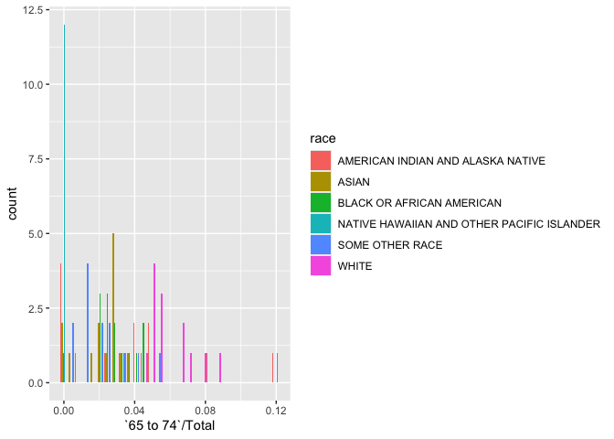
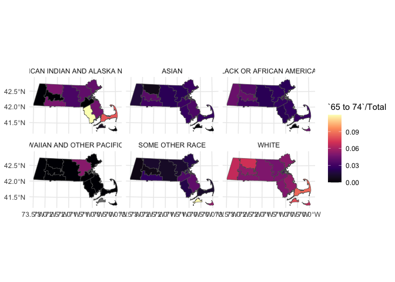
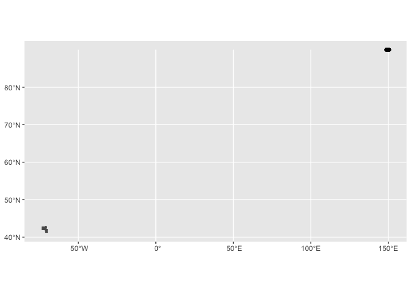
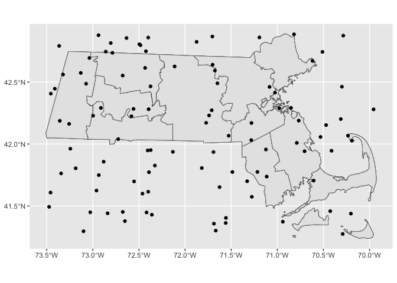

# covid census maps


``` r
library(tidyverse)
```

    ── Attaching core tidyverse packages ──────────────────────── tidyverse 2.0.0 ──
    ✔ dplyr     1.1.4     ✔ readr     2.1.5
    ✔ forcats   1.0.0     ✔ stringr   1.5.1
    ✔ ggplot2   3.5.1     ✔ tibble    3.2.1
    ✔ lubridate 1.9.3     ✔ tidyr     1.3.1
    ✔ purrr     1.0.2     
    ── Conflicts ────────────────────────────────────────── tidyverse_conflicts() ──
    ✖ dplyr::filter() masks stats::filter()
    ✖ dplyr::lag()    masks stats::lag()
    ℹ Use the conflicted package (<http://conflicted.r-lib.org/>) to force all conflicts to become errors

``` r
library(sf)
```

    Linking to GEOS 3.11.0, GDAL 3.5.3, PROJ 9.1.0; sf_use_s2() is TRUE

Our goal for today is to study the relationship between Covid deaths in
an area and the population demographics in that area.

## Load the covid data

First we’ll load in the files from the NY Times Gihub repository that
I’ve copied here. This data has daily totals for COVID cases and deaths
both by state and by county.

``` r
state_cdf <- read_csv("covid-19-data/us-states.csv")
```

    Rows: 1609 Columns: 5
    ── Column specification ────────────────────────────────────────────────────────
    Delimiter: ","
    chr  (2): state, fips
    dbl  (2): cases, deaths
    date (1): date

    ℹ Use `spec()` to retrieve the full column specification for this data.
    ℹ Specify the column types or set `show_col_types = FALSE` to quiet this message.

``` r
county_cdf <- read_csv("covid-19-data/us-counties.csv")
```

    Rows: 23967 Columns: 6
    ── Column specification ────────────────────────────────────────────────────────
    Delimiter: ","
    chr  (3): county, state, fips
    dbl  (2): cases, deaths
    date (1): date

    ℹ Use `spec()` to retrieve the full column specification for this data.
    ℹ Specify the column types or set `show_col_types = FALSE` to quiet this message.

# Pulling in US Census data

## tidycensus

See https://walker-data.com/tidycensus/index.html for lots of
information.

- First step is to sign up for a census API key
  https://api.census.gov/data/key_signup.html
- Once you get your key, specify it using
  `census_api_key("YOUR API KEY GOES HERE", install = TRUE)`.

``` r
library(tidycensus)
```

## What geography?

Main ones are, in order of specificity,

- us
- region
- division
- state
- county
- county subdivision
- tract
- block group
- block

Note the [GEOID
column](https://www.census.gov/programs-surveys/geography/guidance/geo-identifiers.html).
These IDs are often used in other data sets.

## What variable?

How do I find variables?

``` r
v2020 <- load_variables(2020, "acs5", cache = TRUE)
```

``` r
v2020 |> filter(str_detect(concept, "AGE")) |> View()
```

Search through this in an Excel-like way using `View(v2020)`. It can be
tricky to find things at first.

``` r
vars_df <- v2020 |>
  filter(str_detect(concept, "^SEX BY AGE \\(.* ALONE\\)")) |> 
  filter(label %in% c("Estimate!!Total:", "Estimate!!Total:!!Male:!!65 to 74 years")) |>
  mutate(
    variable = name,
    age = if_else(
      str_detect(label, "65 to 74"),
      "65 to 74", 
      "Total"
    ),
    race = str_extract(concept, "\\((.*) ALONE\\)", group = 1),
    .keep = "none"
  )

age_df <- get_acs(
    geography = "county",
    state = "MA",
    variables = vars_df |> pull(variable),
    year = 2020,
    geometry = TRUE
  ) |>
  left_join(vars_df) |> 
  select(-moe, -variable, -NAME) |> 
  rename(FIPS = GEOID) |> 
  pivot_wider(names_from = "age", values_from = "estimate")
```

    Getting data from the 2016-2020 5-year ACS

    Joining with `by = join_by(variable)`

# Making a map

``` r
ggplot(age_df, aes(x = `65 to 74` / Total, fill = race)) + 
  geom_histogram(position = "dodge")
```

    `stat_bin()` using `bins = 30`. Pick better value with `binwidth`.

    Warning: Removed 1 row containing non-finite outside the scale range
    (`stat_bin()`).



``` r
age_df |>
  ggplot(aes(fill =  `65 to 74` / Total)) + 
  geom_sf() +
  facet_wrap(~race) +
  coord_sf(crs = 26986) +
  scale_fill_viridis_c(option = "magma")+
  theme_minimal()
```



## Coordinate Reference Systems

If you start with spatial data, it will usually have a coordinate
reference system.

``` r
library(sf)
st_crs(age_df)
```

    Coordinate Reference System:
      User input: NAD83 
      wkt:
    GEOGCRS["NAD83",
        DATUM["North American Datum 1983",
            ELLIPSOID["GRS 1980",6378137,298.257222101,
                LENGTHUNIT["metre",1]]],
        PRIMEM["Greenwich",0,
            ANGLEUNIT["degree",0.0174532925199433]],
        CS[ellipsoidal,2],
            AXIS["latitude",north,
                ORDER[1],
                ANGLEUNIT["degree",0.0174532925199433]],
            AXIS["longitude",east,
                ORDER[2],
                ANGLEUNIT["degree",0.0174532925199433]],
        ID["EPSG",4269]]

If you have data with latitude and longitude columns, you’ll need to
specify a CRS if you want to align it with other data.

Here we just create some random data inside the bounding box.

``` r
set.seed(1234)
bbox <- st_bbox(age_df)
ll_df <- tibble(
  lat = runif(100, bbox$xmin, bbox$xmax),
  long =  runif(100, bbox$ymin, bbox$ymax),
  val = runif(100)
)
```

If the CRS don’t match, you can run into trouble.

``` r
ll_sf <- ll_df |>
  st_as_sf(coords = c("lat", "long")) |> 
  st_set_crs(4380)

ggplot(age_df) +
  geom_sf() +
  geom_sf(data = ll_sf)
```



The easiest way to pick the CRS is to use one from another dataset.

``` r
ll_sf <- ll_df |> 
  st_as_sf(coords = c("lat", "long")) |> 
  st_set_crs(st_crs(age_df))

ggplot(age_df) +
  geom_sf() +
  geom_sf(data = ll_sf)
```



## Spatial Filters and Joins

We can filter a spatial data set to only include data that intersects
with another data set.

``` r
st_filter(age_df, ll_sf)
```

    Simple feature collection with 66 features and 4 fields
    Geometry type: MULTIPOLYGON
    Dimension:     XY
    Bounding box:  xmin: -73.50814 ymin: 41.4811 xmax: -69.92839 ymax: 42.74594
    Geodetic CRS:  NAD83
    # A tibble: 66 × 5
       FIPS  race                                         geometry  Total `65 to 74`
     * <chr> <chr>                              <MULTIPOLYGON [°]>  <dbl>      <dbl>
     1 25027 WHITE                       (((-72.31363 42.3964, -7… 679581      33648
     2 25027 BLACK OR AFRICAN AMERICAN   (((-72.31363 42.3964, -7…  41566        916
     3 25027 AMERICAN INDIAN AND ALASKA… (((-72.31363 42.3964, -7…   1768         59
     4 25027 ASIAN                       (((-72.31363 42.3964, -7…  41349        922
     5 25027 NATIVE HAWAIIAN AND OTHER … (((-72.31363 42.3964, -7…    298          0
     6 25027 SOME OTHER RACE             (((-72.31363 42.3964, -7…  25702        268
     7 25011 WHITE                       (((-73.02301 42.74114, -…  64910       4581
     8 25011 BLACK OR AFRICAN AMERICAN   (((-73.02301 42.74114, -…    785         28
     9 25011 AMERICAN INDIAN AND ALASKA… (((-73.02301 42.74114, -…    124          6
    10 25011 ASIAN                       (((-73.02301 42.74114, -…   1058          6
    # ℹ 56 more rows

(Change the `.predicate` parameter if you want to filter according to
something besides intersects.)

Joins can be used to link something like latitude longitude to other
spatial data.

``` r
ll_sf |>
  st_join(age_df, join = st_within) |>
  st_drop_geometry()
```

    # A tibble: 280 × 5
         val FIPS  race                                        Total `65 to 74`
     * <dbl> <chr> <chr>                                       <dbl>      <dbl>
     1 0.661 <NA>  <NA>                                           NA         NA
     2 0.528 25021 WHITE                                      535717      26078
     3 0.528 25021 BLACK OR AFRICAN AMERICAN                   50508       1320
     4 0.528 25021 AMERICAN INDIAN AND ALASKA NATIVE            1021          0
     5 0.528 25021 ASIAN                                       79812       2299
     6 0.528 25021 NATIVE HAWAIIAN AND OTHER PACIFIC ISLANDER    264          0
     7 0.528 25021 SOME OTHER RACE                             11640        407
     8 0.317 <NA>  <NA>                                           NA         NA
     9 0.768 <NA>  <NA>                                           NA         NA
    10 0.526 <NA>  <NA>                                           NA         NA
    # ℹ 270 more rows

# Going back to the COVID data

``` r
age_df |> left_join(county_cdf, join_by(FIPS == fips), relationship = "many-to-many")
```

    Simple feature collection with 1818 features and 9 fields
    Geometry type: MULTIPOLYGON
    Dimension:     XY
    Bounding box:  xmin: -73.50814 ymin: 41.23796 xmax: -69.92839 ymax: 42.88659
    Geodetic CRS:  NAD83
    # A tibble: 1,818 × 10
       FIPS  race                       geometry  Total `65 to 74` date       county
       <chr> <chr>            <MULTIPOLYGON [°]>  <dbl>      <dbl> <date>     <chr> 
     1 25027 WHITE (((-72.31363 42.3964, -72.31… 679581      33648 2020-03-08 Worce…
     2 25027 WHITE (((-72.31363 42.3964, -72.31… 679581      33648 2020-03-09 Worce…
     3 25027 WHITE (((-72.31363 42.3964, -72.31… 679581      33648 2020-03-10 Worce…
     4 25027 WHITE (((-72.31363 42.3964, -72.31… 679581      33648 2020-03-11 Worce…
     5 25027 WHITE (((-72.31363 42.3964, -72.31… 679581      33648 2020-03-12 Worce…
     6 25027 WHITE (((-72.31363 42.3964, -72.31… 679581      33648 2020-03-13 Worce…
     7 25027 WHITE (((-72.31363 42.3964, -72.31… 679581      33648 2020-03-14 Worce…
     8 25027 WHITE (((-72.31363 42.3964, -72.31… 679581      33648 2020-03-15 Worce…
     9 25027 WHITE (((-72.31363 42.3964, -72.31… 679581      33648 2020-03-16 Worce…
    10 25027 WHITE (((-72.31363 42.3964, -72.31… 679581      33648 2020-03-17 Worce…
    # ℹ 1,808 more rows
    # ℹ 3 more variables: state <chr>, cases <dbl>, deaths <dbl>
